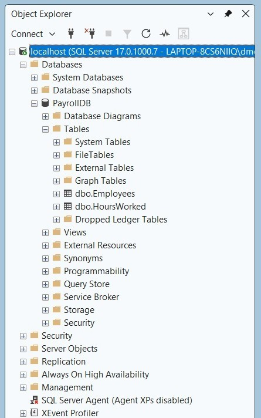

# SQL Payroll Automation Project

## Overview
This project is a beginner SQL payroll database built using Microsoft SQL Server and SQL Server Management Studio (SSMS).

The database stores employee payroll information and hours worked data to demonstrate basic database design and SQL development skills.

## Features
- Created PayrollDB database
- Created Employees table
- Created HoursWorked table
- Used primary keys and identity columns
- Stored employee payroll and work hour information
- Generated SQL database scripts using SSMS

## Tools Used
- Microsoft SQL Server
- SQL Server Management Studio (SSMS)

## Project Files
- PayrollDB.sql
- screenshots/

## Screenshot
Database tables created in SSMS:

