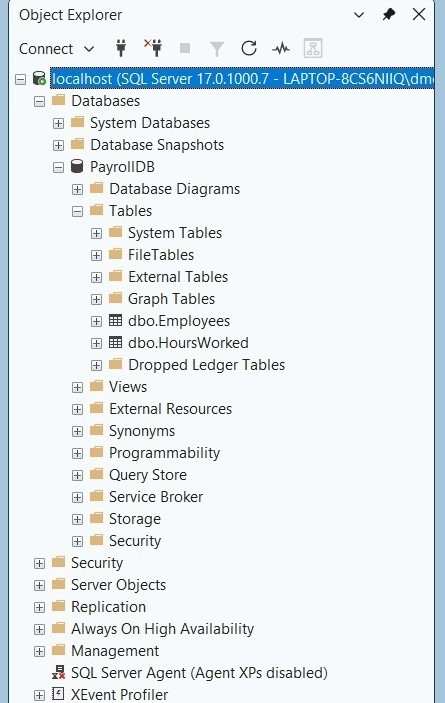

# SQL Payroll Automation Project

## Overview

This project is a beginner SQL payroll database built using Microsoft SQL Server and SQL Server Management Studio (SSMS).

The database stores employee payroll information and hours worked data to demonstrate foundational database design, SQL development, and data management skills.

---

## Skills Learned

- SQL Database Design
- Table Creation
- Primary Key Implementation
- Identity Columns
- Data Modeling
- SQL Scripting
- Database Management
- SQL Server Administration
- Technical Documentation

---

## Tools Used

- Microsoft SQL Server
- SQL Server Management Studio (SSMS)

---

## Lab Environment

| Component | Description |
| ---------- | ----------- |
| Database | PayrollDB |
| Table 1 | Employees |
| Table 2 | HoursWorked |
| Development Tool | SQL Server Management Studio (SSMS) |
| Database Platform | Microsoft SQL Server |

---

## Key Accomplishments

- Designed and implemented a SQL payroll database.
- Created the Employees and HoursWorked tables.
- Implemented Primary Keys and Identity Columns.
- Developed and exported SQL scripts.
- Demonstrated foundational SQL and database administration concepts.
- Documented the project for portfolio presentation.

---

## Project Files

- PayrollDB.sql
- screenshots/

---

## Screenshot

### Payroll Database Tables

Verified the successful creation of the Employees and HoursWorked tables within the PayrollDB database.

---

## Project Status

- Status: COMPLETE
- Version: 1.0
- Completed: July 2026
